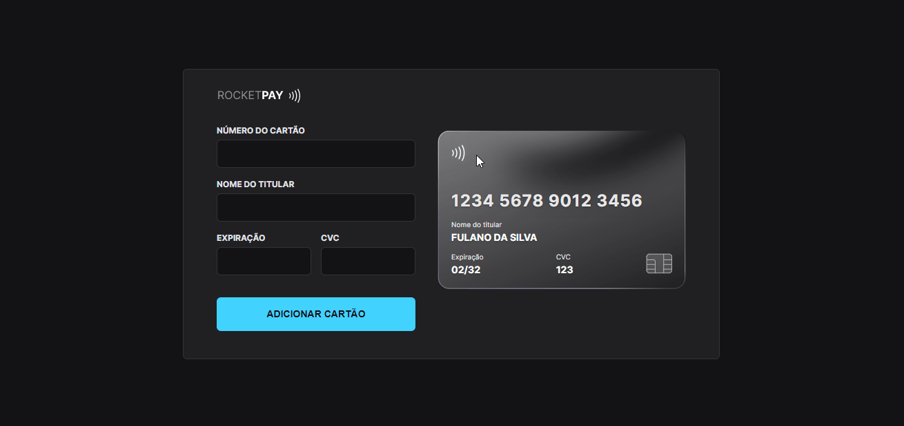

<h1 align="center"> RocketPay </h1>

  <a href="#-technologies">Technologies</a>&nbsp;&nbsp;&nbsp;|&nbsp;&nbsp;&nbsp;
  <a href="#-project">Project</a>&nbsp;&nbsp;&nbsp;|&nbsp;&nbsp;&nbsp;
  <a href="#-layout">Layout</a>&nbsp;&nbsp;&nbsp;|&nbsp;&nbsp;&nbsp;
  <a href="#-license">License</a>

  

 

  

## 🚀 Technologies

This project was developed with the following technologies:

- HTML and CSS
- JavaScript and JSON
- Git and GitHub
- [Node e NPM](https://nodejs.org/)
- [Vite](https://vitejs.dev/)
- [iMask](https://imask.js.org)

## 💻 Project

Rocketpay is a component that simulates the credit card filling form, where it is possible to add mask to the inputs and update HTML elements via DOM.

[Click here to access the website](https://rocketpay-httpedroluiz.vercel.app/)

## 🎨 Layout

You can view the layout of the project through [THIS LINK](https://www.figma.com/file/gpqavL469k0pPUGOmAQEM9/Explorer-Lab-%2301/duplicate). You need an account on [Figma](https://figma.com) to access it.

## 📃 License

This project is under the MIT license.

---

